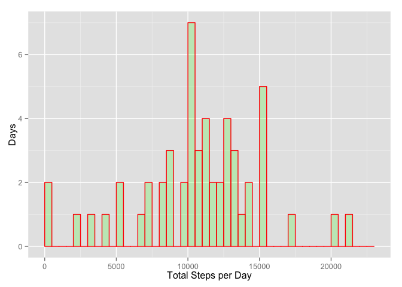
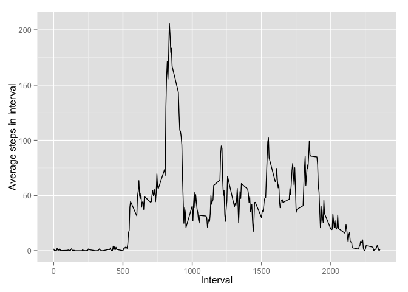
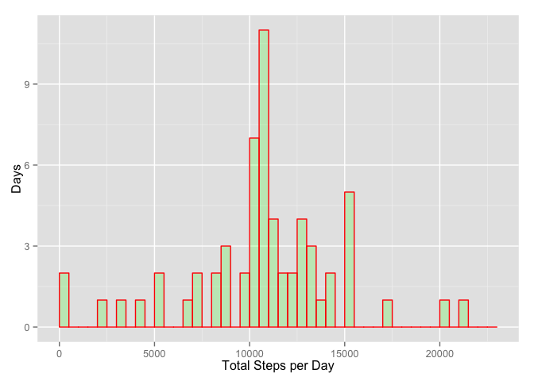
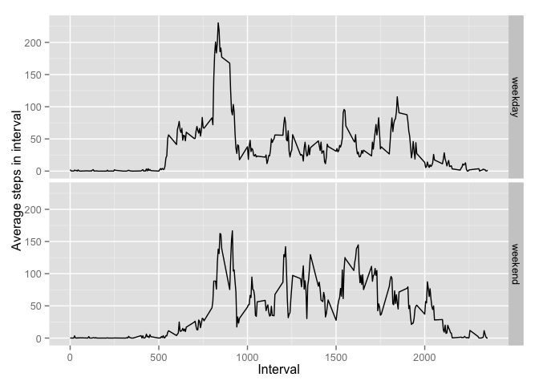

# Reproducible Research: Peer Assessment 1


## Loading and preprocessing the data
The data have been provided in `activity.zip`. Set the working directory to 
the location of the data file. 


```r
setwd("~/Documents/DataScienceJHU/RWork/reproducible/RepData_PeerAssessment1/")
df = read.csv(unz("activity.zip","activity.csv"))
```

## What is mean total number of steps taken per day?

```r
library(dplyr)
```

```r
totdf <- summarize(group_by(df,date), 
                   tot=sum(steps)  )
library(ggplot2)
ggplot(data=totdf, aes(totdf$tot)) + 
    geom_histogram(breaks=seq(0, 23000, by = 500), 
                 col="red", 
                 fill="green", 
                 alpha = .2) + 
    labs(x="Total Steps per Day", y="Days") 
```

 

What are the mean and median number of steps per day?

```r
mymean = mean(totdf$tot, na.rm=TRUE)
mymedian = median(totdf$tot, na.rm=TRUE)
```
The mean number of steps per day is 1.0766189\times 10^{4} and the median steps per day is 10765.

## What is the average daily activity pattern?

```r
avedf <- summarize(group_by(df,interval), 
                   ave=mean(steps, na.rm=TRUE)  )
ggplot(data=avedf, aes(interval, ave))  + geom_line() +
    xlab("Interval") + ylab("Average steps in interval")
```

 

Which 5-minute interval, averaged over all days in the dataset, contains
the maximum number of steps?

```r
max_steps_interval = max(avedf$ave)
max_interval = avedf[avedf$ave == max(avedf$ave),]$interval
```
On average, the most steps are taken in the interval 835.

## Imputing missing values

How many missing values are in the dataset?

```r
tot_missing = sum(is.na(df$steps))
tot_rows = nrow(df)
```
The total number of missing values is 2304, out of a total of 17568 observations.

One strategy for filling in missing values is to use the mean for the given interval.

```r
impsteps <- ifelse(is.na(df$steps) == TRUE, 
                  avedf$ave[avedf$interval %in% df$interval], 
                  df$steps)
imputed <- mutate(df, steps = impsteps)
```


```r
totimp <- summarize(group_by(imputed,date), 
                   tot=sum(steps)  )
ggplot(data=totimp, aes(tot)) + 
    geom_histogram(breaks=seq(0, 23000, by = 500), 
                 col="red", 
                 fill="green", 
                 alpha = .2) + 
    labs(x="Total Steps per Day", y="Days") 
```

 

What are the mean and median number of steps per day?

```r
newmean = mean(totimp$tot)
newmedian = median(totimp$tot)
```

The mean number of steps per day from the imputed dataset is 1.0766189\times 10^{4} and the median
is 1.0766189\times 10^{4}. For comparison, ignoring NAs in the original data, the mean was
1.0766189\times 10^{4} and the median was 10765. Imputing the values from the averages
does not make big differences in these numbers nor in the histogram of total steps.

## Are there differences in activity patterns between weekdays and weekends?

Make a factor variable with values of "weekend" or "weekday".

```r
isweekday <- ifelse((weekdays(as.Date(imputed$date)) == "Sunday") |
                         (weekdays(as.Date(imputed$date)) == "Saturday"), 
                  "weekend", 
                  "weekday")
weekdaydf <- mutate(imputed, weekday = factor(isweekday))
```


```r
aveimputed <- summarize(group_by(weekdaydf,weekday, interval), 
                   ave=mean(steps)  )
ggplot(aveimputed, aes(interval, ave)) + geom_line() +
    facet_grid(weekday ~ .) +
    labs(x="Interval", y="Average steps in interval")
```

 

From the plot we can see that weekdays have a larger peak in the 835
interval, presumably as people are walking to work or school. Also,
people are walking earlier in the day on weekdays than on weekends.
